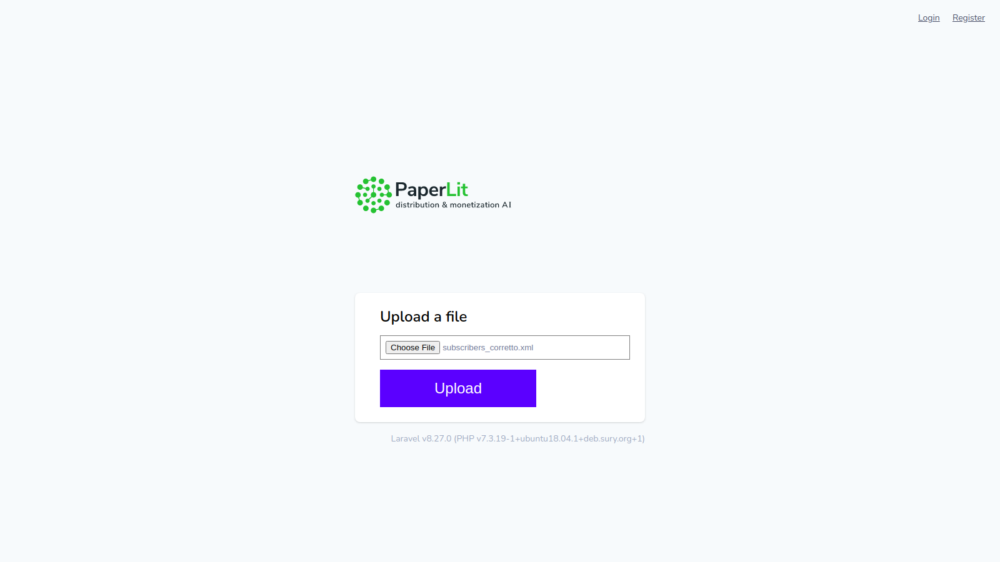
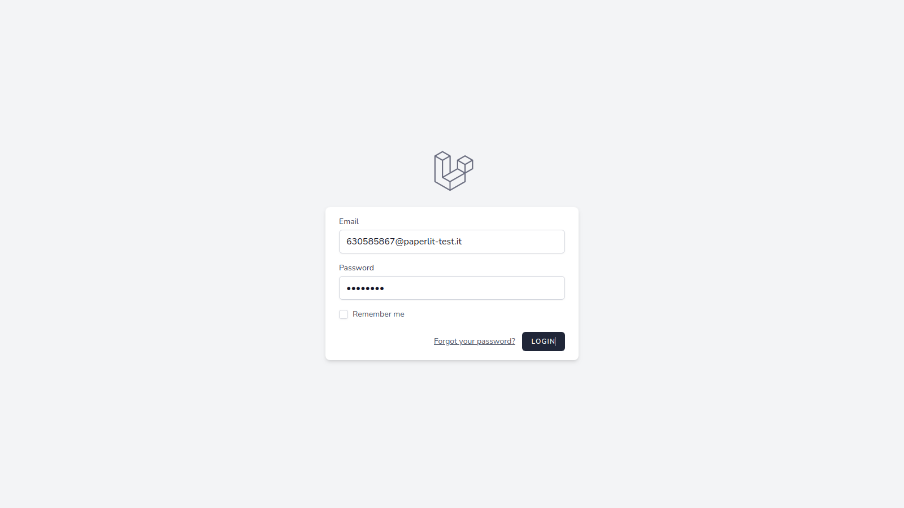
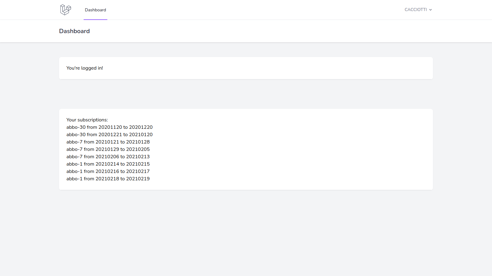
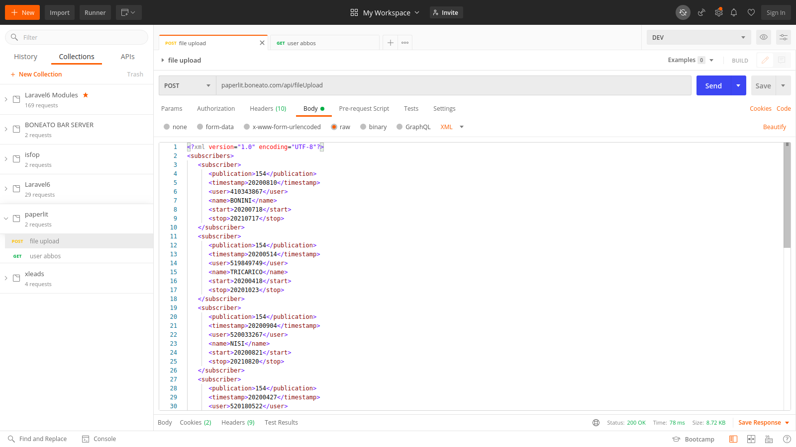
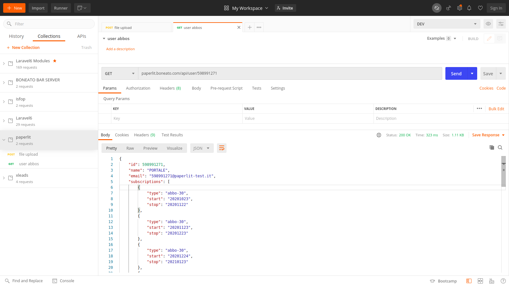

## Implementazione

NOTE : 
- i range di abbonamenti sono stati calcolati partendo dal presupposto che gli intervalli siano inclusivi e quindi non debbano essere contigui, ossia due abbonamenti di 1 giorno consecutivi sono calcolati ad esempio come 20210209/20210210 e 20210211/20210212. Nel caso servisse calcolarli contigui, basta eliminare l'incremento  di 1 giorno nella funzione createAbboRangesForSubscriber() del Service.php    
- il file subscribers di test usato contiene una data invalida: per questo motivo sono stati creati due files, subscribers_corretto.xml e subscribers_test.xml per le prove  
- ogni volta che il file subscribers viene uploadato, il db viene ripulito  

Per avviare l'applicazione è possibile creare un vhost su apache o lanciare il comando solito 'php artisan serve'. 
Una volta visualizzata la home page (es, su localhost:8000) si può procedere, per la parte web, caricando un file xml e procedendo al parsing.  
Dopo il parsing verranno visualizzati gli utenti coi rispettivi set di abbonamenti.  
Si è scelto di raggruppare gli abbonamenti rispetto all'utente univoco.  

Nella parte alta della pagina è presente il link LOGIN dove un utente, dopo l'import, può controllare i suoi abbonamenti, loggandosi con username e password (sono nella forma id_user@paperlit-test.it/username, ad esempio 520783101@paperlit-test.it/niccolini ).    

I controller risiedono nella directory App\Http\Controllers.  
Ce ne sono due, uno rest e uno web.  
Tutti e due rischiamano il Service transazionale (quindi se un'operazione non si conclude a buon fine viene rollbackato tutto) che si occupa di memorizzare i dati su db.  

Il validatore della request del fileUpload risiede nella directory App\Http\Requests (accetta solo XML di massimo 2MB).  

I model sono nella directory  App\Http\Models. Per il model Subscriber(classe di appoggio non persistente) è stato creato un validatore interno basico per il check dei dati dopo il parsing dell'xml.  

E' presente il file paperlit.postman_test.json che contiene due test di prova per Postman con le rotte dell'API.  

## Installazione

su MYSQL:  
CREATE DATABASE paperlit;  
CREATE USER 'paperlit'@'%' IDENTIFIED WITH mysql_native_password BY 'paperlit';  
GRANT ALL PRIVILEGES ON paperlit.* TO 'paperlit'@'%';  
FLUSH PRIVILEGES  
oppure configurare i parametri dell'env secondo il proprio database  

su Laravel:  

git clone https://github.com/mirkopeloso/paperlit.git  
composer install  
php artisan breeze:install  
git reset --hard  
php artisan migrate:fresh  
sudo n stable  
npm install && npm run dev  
sh permfix.sh  

## WEB Routes

GET     /  
POST    /fileupload  
GET     /login      ( username e password sono nella forma id_user@paperlit-test.it/username, ad esempio   520783101@paperlit-test.it/niccolini )  
GET     /dashboard  

## API Routes
POST    /api/fileupload         (parametri : xml string)  
GET     /api/user/?id           (parametri : id dell'utente integer)  

